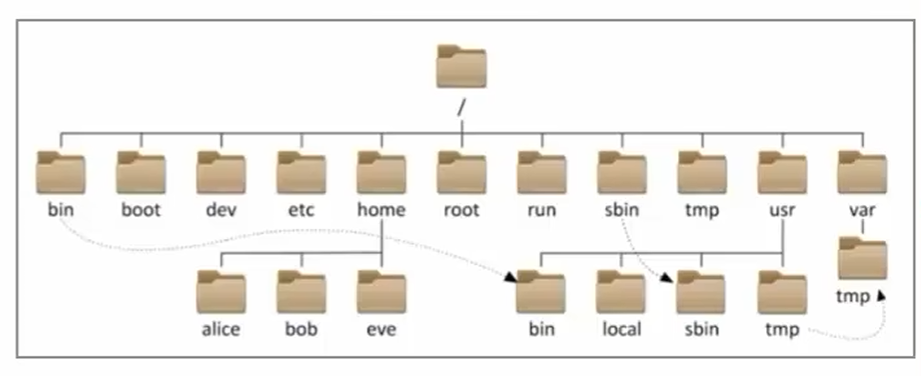

### Linux的目录结构
- Linux没有盘符这个概念，只有一个根目录`/`，所有文件都在它下面
- 在Linux系统中，路径之间的层级关系，使用`/`表示，比如`/home/user/Documents`表示在`/`根目录下的`home`目录下的`user`目录下的`Documents`目录

**出现在开头的`/`表示根目录，出现在后面的`/`表示层级关系**

### Linux命令入门
- 命令行：Linux终端，是一种命令提示符页面
- 命令：Linux程序，比如`ls`、`cd`、`pwd`等

命令的通用格式
```
conmmand [-option] [parameter]
```
- `command`:命令名
- `-option`:命令选项，比如`-l`、`-a`、`-h`等
- `parameter`:命令参数，比如文件名、目录名等

示例：
- `ls -l /home`：列出`/home`目录下的所有文件和目录，并显示详细信息
- `cd /home/user`：切换到`/home/user`目录

#### ls命令
作用：列出目录下的内容
```
ls [-a -l -h]
```
- 当不使用选项和参数，直接使用`ls`命令本体，表示以平铺形式，列出当前工作目录下的内容

Linux徐彤的命令行终端，在启动的时候，默认会加载：
- 当前登录用户的HOME目录为当前工作目录，所以`ls`命令列出的是HOME目录的内容
- HOME目录：每个Linux操作用户在Linux系统的个人账户目录，是根目录下的一个文件夹，路径为`/home/用户名`
    - 如`/home/user`：当前用户的家目录，默认为当前用户的家目录，可以通过`pwd`命令查看


ls命令的选项
- `a`：all,列出所有文件，包括隐藏文件/文件夹
    - 以`.`开头的，表示是Linux系统的隐藏文件/文件夹(只要以`.`开头，就能自动隐藏)
    - 只有通过`-a`命令才能看到隐藏文件/文件夹
- `l`：list，以列表(竖向排列)的形式展示内容，并展示更多详细信息
    - ls命令选项的组合使用：
        ```
        ls -l -a -h
        ls -lah
        ls -alh
        ```
        上述三种写法，都是一样的，表示以列表形式列出所有文件和文件夹，并显示详细信息
- `h`：human-readable，以可读的方式显示文件大小，如：`1.5M`、`1.2G`等，**必须要搭配`-l`使用**

#### cd命令
cd 命令：Change Directory切换目录
```
cd [path]
```
- cd没有选项，只有参数，表示切换到指定目录
- cd命令的参数，可以是绝对路径，也可以是相对路径
- cd命令直接执行，不写参数，表示回到用户的HOME目录

#### pwd命令
pwd 命令：Print Working Directory，无选项，无参数，直接执行，表示打印当前工作目录

#### 绝对路径和相对路径
- 绝对路径：从根目录开始，以`/`开头，比如`/home/user/Documents`表示从根目录开始，到`user`目录下的`Documents`目录
- 相对路径：从当前目录开始，以`.`或`..`开头，比如`./Documents`表示从当前目录开始，到`Documents`目录，`../Documents`表示回到上级目录，再回到`Documents`目录

**特殊路径符**
- `.`:表示当前牡蛎，比如`cd ./Desktop`表示切换到当前目录下的Desktop目录内，和`cd Desktop`效果一致
- `..`:表示上级目录，比如`cd ..`表示回到上级目录，比如当前目录是`/home/user/Documents`，那么`cd ..`表示回到`/home/user`目录。而`cd ../..`表示切换到上二级目录，即回到`/home`目录
- `~`:表示当前用户的HOME目录，比如`cd ~`表示回到当前用户的HOME目录，等同于`cd /home/user`和`cd`，比如`cd ~/Documents`表示回到当前用户的HOME目录下的Documents目录

#### mkdir命令
- mkdir 命令：Make Directory，有可选选项，有参数，表示创建目录
```
mkdir [-p] Linux路径
```
- 参数**必填**，表示Linux路径，即要创建的文件夹的路径，相对路径和绝对路径均可
- `-p`选项可选，表示自动创建不存在的父目录，适用于创建连续多层级的目录，如`mkdir -p /home/user/Documents/Pictures/Wallpapers`

**注意：mkdir操作均在HOME目录内，如在HOME外操作，会出现权限不够错误**
修改方法：在`mkdir`前加上`sudo`，例如`sudo mkdir Pictures/Wallpapers`


